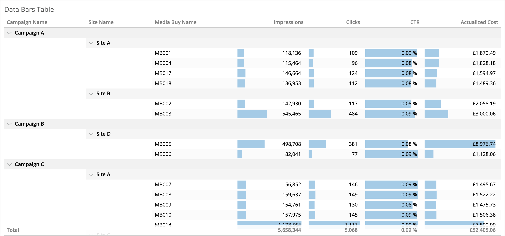

# datorama-d3-data-bars-table
Custom widget for Datorama. Creates an Excel-like Data Bars Table.

This works just like a pivot table, except bars are added inside each cell to show a visual representation of the data, scaled within the column's data range. This combines the exactness of tables with the clarity of bar charts to let you easily identify rows and columns of most interest.

Subtotals currently aren't possible, since that data is not included in the widget query response.



## Common Style Changes
### Change the colour of the bars
Add the below CSS to the CSS section:
```
rect {
	fill: rgb(255, 230, 160);
}
```

### Change the colour of the bars for each individual metric
Use the same CSS as above, but change the selector to `rect.metric0`, `rect.metric1`, etc., according to the index of the measurement you want to change.

## Set up and Dependencies

Add `dataBarsTable.initialize()` to the JS section, and add the below dependencies to the second tab of the Custom Widget Editor.

Script dependencies (must be loaded in this order):

1. https://d3js.org/d3.v5.min.js
2. https://dato-custom-widgets-js-css.s3.eu-west-2.amazonaws.com/data-bars-table/Data+Bars+Table.js

Style dependency:

1. https://dato-custom-widgets-js-css.s3.eu-west-2.amazonaws.com/data-bars-table/Data+Bars+Table.css
